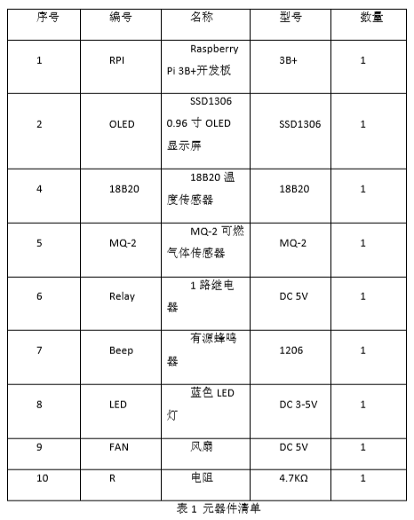
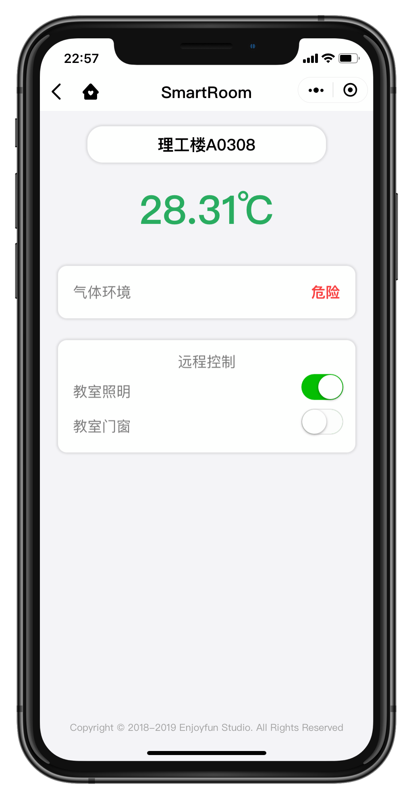
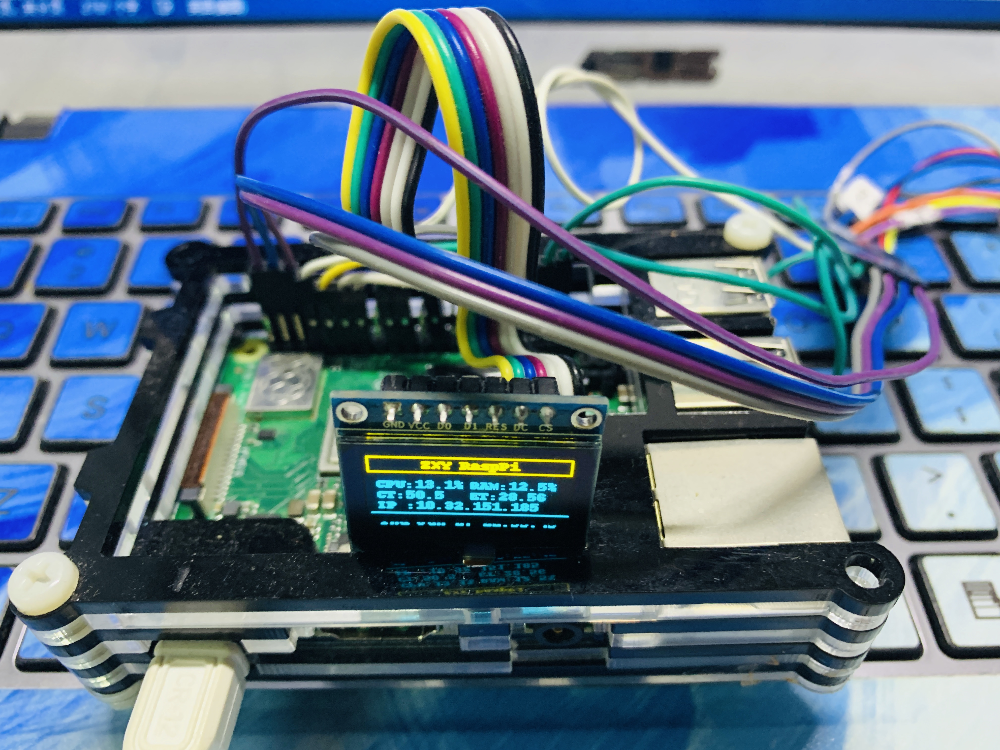
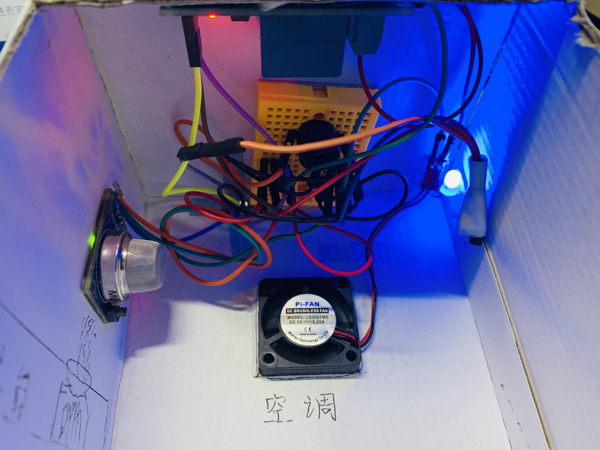

# base-on-RaspberryPi-3B-IOT-Project

## 基于RaspberryPi 3B+和Microsoft的智慧IOT教室实现方案

### 简介：
利用轮询方式获取树莓派监测的温度、湿度、环境烟雾等信息反馈到小程序前端，并实现了公网信息交互，可远程控制LED、风扇的开启与关闭

### 软件：
树莓派端：Python3、frp（内网穿透）、supervisor（进程守护工具） 
服务器端：Nginx、Python3、frp（内网穿透）、supervisor（进程守护工具）

### 人脸识别：
Microsoft人脸识别API

### 硬件清单：

### 效果图：

## 联系我：
微信：Flycoolzxy 
网站：https://enjfun.com
